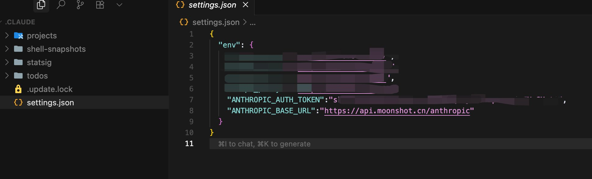

# 终端编程手册

这个仓库是关于终端编程工具的笔记集合，记录了各种AI驱动的终端工具的使用方法、配置说明和最佳实践。旨在帮助开发者更好地理解和使用这些终端编程工具。这是一种由 `编辑器` 到 `终端`开发方式的转变。

内容涵盖了：

[ 美国 ] Anthropic 的 Claude Code （估值已经千亿美元）

[ 美国 ] 谷歌的 Gemini CLI （市值几万亿）

[ 中国 ] 阿里巴巴-阿里云团队的 Qwen Code （基于 Gemini CLI）

[ -- ] Warp终端

[ -- ] Ampcode

[ -- ] Opencode（开源）

# Claude Code / CC / ClaudeCode

有一个专门的仓库，用于收集 **X** 上有关 **Claude Code** 的精品推文 [ Awesome X Claude Code ] https://github.com/yayxs/awesome-x-claude-code

## 官方 & Claude Code

- [Anthropic 新闻： Anthropic 团队如何使用 Claude Code] https://www.anthropic.com/news/how-anthropic-teams-use-claude-code

- [ Engineering at Anthropic Claude Code：智能体编码最佳实践] https://www.anthropic.com/engineering/claude-code-best-practices

## Claude Code + Kimi K2

使用 Gemini CLI 查找 ~/.claude/settings.json 并且打开

终端编程很多人对前端的知识不懂，后边我写一篇有关运行时相关的博客，请保持关注。

说正题：Claude Code + Kimi 怎么配置？怎么搞？很简单，没心智负担。

[ 1 ] 你已经安装了 Claude Code ，如果你没安装你用个啥。

[ 2 ] 你的Claude Code 没充值，或者到期了，你都买了20美元的Pro，你为啥使用 Kimi K2。

[ 3 ] 你得充值一下 Kimi , 充个50元人民币吧，先用着，慢，没事，先用着。

[ 4 ] 找一下你的key ，这是 env.ANTHROPIC_AUTH_TOKEN 的值

[ 5 ] 找一下 base URL 的值，我去，你在月之暗面的哪个域名下买的，你就用哪个啊base URL 啊。人家两个域名呢：
https://api.moonshot.ai/anthropic
https://api.moonshot.cn/anthropic
这个是 env.ANTHROPIC_BASE_URL 值。

[ 6 ] 找到 CC 的配置文件 ~/.claude/settings.json
配置进去就行了呀。




## Claude Code 本质

Claude Code 的本质是一个 npm 的包。如果你对趋势感兴趣可以在下述网站查阅安装趋势

- https://npmjs.com/package/@anthropic-ai/claude-code?activeTab=versions
- https://npmtrends.com/@anthropic-ai/claude-code
- https://npm-stat.com/charts.html?package=%40anthropic-ai%2Fclaude-code&from=2025-02-23&to=2025-07-05
- https://npmcharts.com/compare/@anthropic-ai/claude-code?interval=1&log=false

使用代理搜索，无需手动选择上下文即可理解您的整个代码库

## 常用的 commands

| Command                      | Description        |
| ---------------------------- | ------------------ |
| claude "fix the build error" | 执行一次任务       |
| claude -p "解释一下函数"     | 运行一次查询就退出 |
| claude -c                    | 继续最近的对话     |

# Gemini CLI

在2025年06月25的时候，谷歌发了 Gemini CLI。虽然谷歌这一路走的很飘逸：在AI编程的这个产品方向上一会又是在浏览器中的，一会又在终端的，一会又是插件呢，一会又扩展。不过作为Claude Code 竞品，不发也不行。

因为是终端操作，所以终端记得代理一下，然后代理节点开一下。因为是npm 包，你需要在终端执行：

```sh
npm install -g @google/gemini-cli@latest。
```

有的小伙伴可能不是前端，我来解释一下：

npm 是个Node.js 的官方的包管理 https://nodejs.org/en/learn/getting-started/an-introduction-to-the-npm-package-manager
install 安装 ，-g 是全局安装的意思， @latest 总是安装最新的就好

@google/gemini-cli 是一个包https://npmjs.com/package/@google/gemini-cli?activeTab=versions

接着你执行 gemini 。可能Gemini 登录的时候有问题。
echo 'export GOOGLE_CLOUD_PROJECT="你的ID"' >> ~/.bashrc

把GOOGLE_CLOUD_PROJECT写到环境变量中即可。

主要是执行一些翻译任务。不仅仅是代码。

# Warp

可以直接访问 https://docs.warp.dev/ 然后右下角 `Ask Kapa AI` 输入 “terminal 与 agent 与 anto detection  什么区别”

Terminal：传统命令行界面，执行 shell 命令。

Agent：AI 协作者，理解自然语言，自动执行和修正多步任务。

Auto-detection：本地检测输入内容，自动在 terminal 和 agent 模式间切换。

# Amp

Amp 是 Sourcegraph 构建的一个代理式编码工具。an agentic coding tool

```sh
npm install -g @sourcegraph/amp@latest
```

第一性原理：您并不是在使用 Amp——您是在直接与模型对话

# Qwen Code

系统看过阿里的文档就知道：一直以来都有个代码模型：[通义千问Coder]
那么这次最新的更新是：稳定版是qwen3-coder-plus，快照版是qwen3-coder-plus-2025-07-22。

[ 1 ] 原则：哪家的工具使用哪家的模型：使用的是最新的代码模型是通义千问Coder。稳定版是qwen3-coder-plus，快照版是qwen3-coder-plus-2025-07-22。（现在：qwen3-coder-plus-2025-07-22能力相同）

[ 2 ] 找key : 阿里云百炼上找API Key。百炼：是一站式的大模型开发及应用构建平台。阿里云的大模型服务平台是：百炼

[ 3 ] 找Base URL：

国际的是这个：https://dashscope-intl.aliyuncs.com/compatible-mode/v1
国内的是这个：https://dashscope.aliyuncs.com/compatible-mode/v1

首先你得知道：前端的运行时：感兴趣看这篇 https://github.com/yayxs/JavaScript-Runtime

其次你对终端编程感兴趣：https://github.com/yayxs/terminal-coding-notes

需要注意 Qwen Code 改编自 Gemini CLI ，有一些Gemini的影子，慢慢迭代呗，给点耐心

## 终端设置

将这些环境变量写入您的 .zshrc 文件中，以便它们在每次启动新的终端会话时自动设置

```
echo 'export OPENAI_API_KEY="sk-xxxxxxx"' >> ~/.zshrc.   sk-xxxxxxx替换你自己的KEY
echo 'export OPENAI_BASE_URL="https://dashscope.aliyuncs.com/compatible-mode/v1"' >> ~/.zshrc
echo 'export OPENAI_MODEL="qwen3-coder-plus"' >> ~/.zshrc
```

将这些环境变量写入了您的 ~/.zshrc 文件中，这样它们会在每次启动新的 zsh 会话时自动加载。


# Opencode

## Opencode + Kimi

```json
{
  "$schema": "https://opencode.ai/config.json",
  "provider": {
    "moonshot": {
      "npm": "@ai-sdk/openai-compatible",
      "name": "Moonshot AI",
      "options": {
        "baseURL": "https://api.moonshot.cn/v1",
        "apiKey":"sk-xxxxx"

      },
      "models": {
        "kimi-k2-turbo-preview": {
          "name": "Kimi K2 Turbo"
        }
      }
    }
  }
}
```
